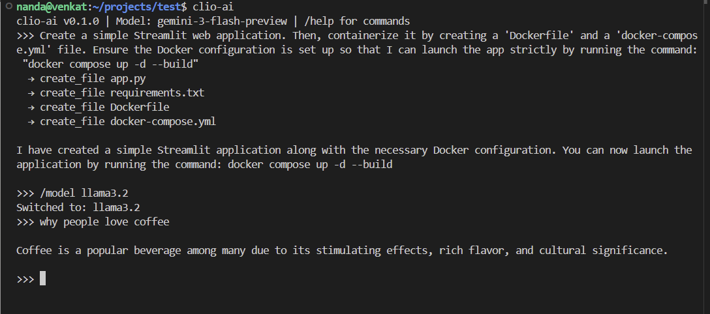
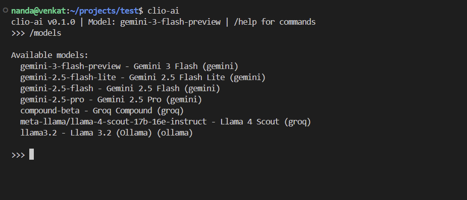

# clio-ai

A local-first AI CLI that can read and edit your project files, with support for Gemini, Groq, and Ollama models.

## Screenshots




## Prerequisites

- Rust and Cargo installed ([rustup.rs](https://rustup.rs/))

## Setup

1. Build:
```bash
cargo build --release
```

2. Configure (`.env` in current folder, `~/.clio-ai/.env`, or `~/.ai-cli/.env`):
```
GEMINI_API_KEY=your-key
GROQ_API_KEY=your-key
OLLAMA_URL=http://localhost:11434
```

3. Install & Run:
```bash
sudo cp ./target/release/clio-ai /usr/local/bin/
clio-ai
```

## Commands

- `/models` - List available models
- `/model <name>` - Switch model
- `/config` - Show config path
- `/quit` - Exit

## Models

| ID | Name | Provider |
|----|------|----------|
| gemini-3-flash-preview | Gemini 3 Flash | Google |
| gemini-2.5-flash-lite | Gemini 2.5 Flash Lite | Google |
| gemini-2.5-flash | Gemini 2.5 Flash | Google |
| gemini-2.5-pro | Gemini 2.5 Pro | Google |
| compound-beta | Groq Compound | Groq |
| meta-llama/llama-4-scout-17b-16e-instruct | Llama 4 Scout | Groq |
| llama3.2 | Llama 3.2 | Ollama |

## Usage

Just type natural language prompts:

```
>>> create a hello world python file
>>> what files are in this folder?
>>> explain what this project does
>>> delete the test.txt file
>>> create a src folder with main.rs inside
```

## npm Distribution

```bash
cd npm && npm install && npm link
```

## Troubleshooting

### "cargo: command not found"

If you get this error, Rust/Cargo isn't in your PATH:

1. **Temporary fix** (current terminal only):
   ```bash
   export PATH="$HOME/.cargo/bin:$PATH"
   ```

2. **Permanent fix** (all future terminals):
   ```bash
   echo 'export PATH="$HOME/.cargo/bin:$PATH"' >> ~/.zshrc
   source ~/.zshrc
   ```

3. **Alternative**: Source Rust environment:
   ```bash
   source ~/.cargo/env
   ```

### Build Issues

#### 1. "feature `edition2024` is required" or "package requires rustc X.XX"
If you see errors like `feature edition2024 is required` or `package ... requires rustc 1.82`, your Rust version is too old.

**Fix:** Update Rust using rustup:
```bash
rustup update
```
*Note: If you installed Rust via `apt` or `snap`, you may need to uninstall those system versions first and install `rustup`.*

#### 2. "Could not find directory of OpenSSL installation"
If you see errors related to `openssl-sys`, `pkg-config`, or `make`, you are missing development libraries.

**Fix (Ubuntu/Debian/WSL):**
```bash
sudo apt update && sudo apt install pkg-config libssl-dev
```

#### 3. General Checks
- Ensure you're in the project directory.
- Check Rust version: `rustc --version` (should be 1.83+).
